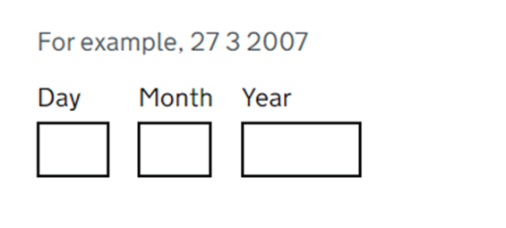

**Fråga användare efter**

# Datum

Hjälp användaren att välja rätt datum och minska risken för felaktiga datumformat.

## Använd mönstret när

Beskrivning.

## Använd inte mönstret när

Beskrivning.

## Så fungerar mönstret

Sättet vi frågar efter datum beror på situationen. Användaren kan behöva fylla i följande typer av datum:

1. ett datum som användaren kommer ihåg till exempel en födelsedag
2. ett datum som finns i ett dokument som användaren har till hands, till exempel ett inflyttningsdatum i ett hyreskontrakt eller pass
3. ungefärliga datum, som "december 2024"
4. relativa datum, som ”4 dagar från idag” eller ”onsdag förra veckan”
5. återkommande datum – t.ex. varje torsdag. [behöver denna finnas med?].

I vissa fall kan du behöva be användaren att välja ett datum från ett givet urval.

### 1. Ber om ett datum som användaren kommer ihåg

Be om minnesvärda datum, som födelsedatum. [Här har UK GOV en modell som bygger på följande datuminmatningskomponenten vi ska ju inte tala om exakt hur vilken komponent som ska användas hos respektive myndighet – vad kan vi skriva här som hjälper myndigheterna att göra rätt?]

<picture>
  <source srcset="../assets/images/datum-boxar.webp" type="image/webp">
  
</picture>

### 2. Ber om datum som användaren har tillhands, t.ex. från ett dokument

När du ber om ett datum exakt som det visas på ett pass, kreditkort eller annat dokument, se till att fälten matchar originalets format. Detta gör det lättare för användare att kopiera datumet korrekt.

[Håller vi oss till uppgifter som man i Sverige använder på pass, osv så kan vi ge detta rådet. Går vi utanför till andra länder blir det svårt att leva upp till det då formaten är olika.]

Uppdaterad 2024-11-25 /Patrik E.

### 3. Ber om ungefärliga datum

Tillåt användare att ange ett ungefärligt datum när du ber dem om information som de kanske inte känner till eller kanske har svårt att komma ihåg. Tillåt till exempel användare att ange "December 2017" för ett fält som säger "datumet då du förlorade ditt pass".

### 4. Ber om relativa datum

Du kan behöva be om datum som är relativa till dagens datum eller ett annat datum - detta är vanligt om en användare ställer in en påminnelse.

För att göra detta låt användarna ange eller välja relativa datum som "i morgon" eller "1 dag innan". Om veckodagen är viktig, visa detta också.

### 5. Hjälper användare att välja ett datum

Användare kan behöva välja ett datum från ett urval, till exempel för att boka ett möte.

För att göra detta kan du presentera datum i ett kalenderformat med hjälp av en kalenderkomponent. Vanligtvis visas en månads datum åt gången och det går att hoppa mellan månader och år.

Använd endast en kalenderkontroll om användare behöver:

- välj ett datum inom en snar framtid eller nyligen förflutna
- känna till veckodagen, eller månadens vecka, samt datum
- kunna se datum i förhållande till andra datum.

Gör aldrig en kalenderkomponent som är beroende av JavaScript som det enda inmatningsalternativet. Tillåt användare att ange datum i en textinmatning samt använda komponenten.

### Hur man skriver datum

> Har kommit hit i redigeringen /2024-11-25, Patrik E

> Se stilen GOV.UK för att skriva [datum och datumintervall](https://design-system.service.gov.uk/patterns/dates/)].

> Om du anger ett exempeldatum, använd 13 eller mer för dagen och 9 eller mindre för månaden - till exempel '27 3 2007'. Detta hjälper användare att ange datumet i rätt ordning och visar dem att de inte behöver inkludera inledande nollor.
