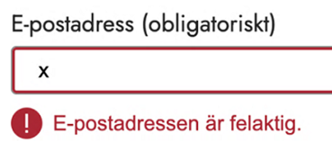

**Fråga användare efter**

# E-postadress

## Använd mönstret när

Använd mönstret i alla situationer när du behöver en persons e-post när Mönstret för e-postadress/mejladress kan användas både i e-tjänster och blanketter. Fråga bara efter e-postadress/mejladress när det behövs.

## Använd inte mönstret när

Beskrivning.

## Så fungerar mönstret

### Hit kom vi

- Används inte så ofta i våra tjänster, men tex brister i digital tillgänglighet
- Pensionsmyndigheten vill gärna ha det i alla deras tjänster för att skicka bekräftelse.
- Det är oftast valfritt, vissa anger att det är valfritt, men inte alltid, även om det inte är obligatoriskt.
- Svenska ordet, e-postadress el mejladress?
- Fk har oftast ordet mejladress
- Aldrig mailadress. Att det följer myndighetens tonalitet?
- Viktigast att det är samma inom resp myndighet
- Frågelådan (både mejl och e-post är godkänt enl frågelådan, Institutet för språk och folkminnen (Isof)
- Felmeddelande, ska vara vänligt.
  - Bra exempel:
    - Kontrollera att din mejladress (e-postadress) stämmer
    - Mejladressen måste innehålla ett @
- Din e-postadress verkar inte stämma. Kontrollera att du har skrivit rätt format.
  - Mindre bra exempel:
    - Uppgift saknas, fyll i e-postadress.
    - Fel format, fyll i en giltig e-postadress

<picture>
  <source srcset="../assets/images/e-post-adress-obligatorisk.webp" type="image/webp">
  
</picture>

- Valideringstexten bör vara ovanför och inte under, men också att fältet är annan färg, att inte bara ha färg utan också ikon
- Om det går att spåra vad användaren har gjort för fel och det går att skriva ut vad som borde rättas.
- Exempel på att ge ett förslag på vad som kan vara rätt:
  - <https://github.com/alphagov/govuk-design-system-backlog/issues/45#issuecomment-41499911>
- Kontrollera att det finns ett @ bör prioriteras om man bara ska ha en validering.
