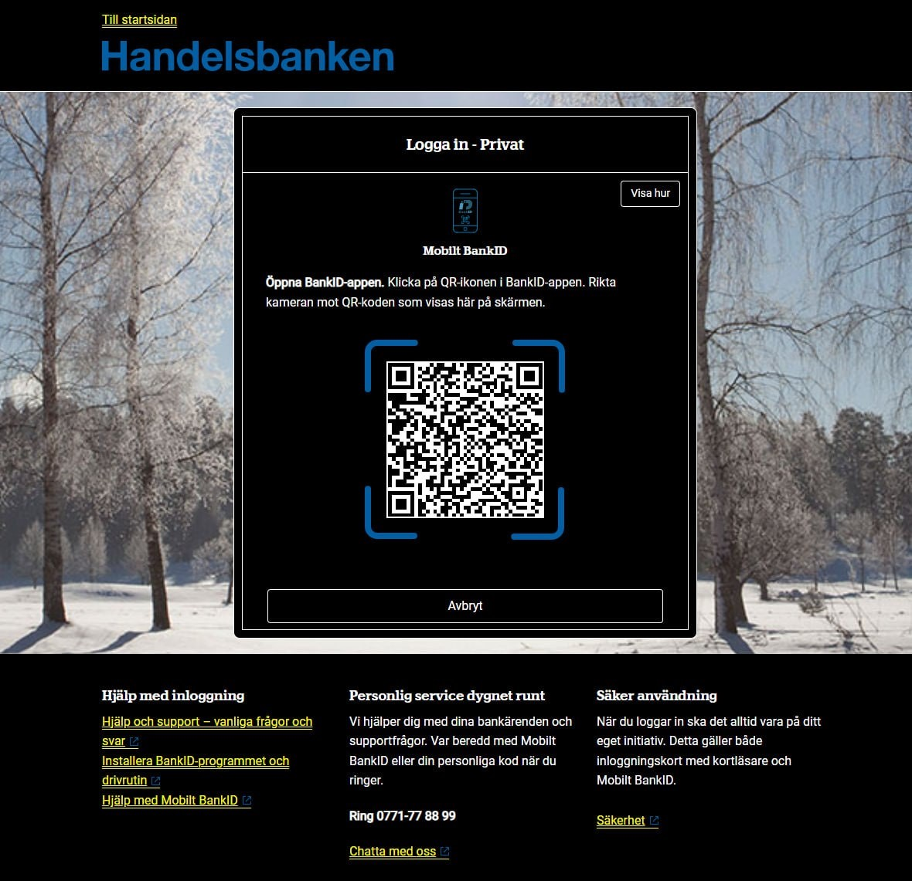

**Fråga användare efter**

# QR-kod

## Använd mönstret när

- Användaren ska logga in med BankID.
  - Från och med 1 maj 2024 är det obligatoriskt med QR-kod för BankID.

## Använd inte mönstret när

Hjälp alla användare att skanna en QR-kod genom att se till att:

- QR-koden går att förstora 400 procent utan att den döljs
- QR-koden följer med (”sticky”) om användaren förminskar webbläsarfönstret.
- QR-koden alltid syns i sin helhet
- QR-koden fungerar även i högkontrastläge med inverterade färger.
  - Vit ram runt själva koden.
- det finns tillräckligt med tid (minst 3 minuter) innan time-out
- instruktioner är tydliga och fungerar även för den som använder skärmläsare.

## Exempel

### Forskning/användartestning av mönstret

- [Tillgänglig inloggning med QR-kod (axbom.se)](https://axbom.se/tillganglig-inloggning-med-qr-kod/)
- Exempel på QR-kod i mörkt läge från Handelsbanken:

<picture>
  <source srcset="../assets/images/handelsbanken-qr-kod.webp" type="image/webp">
  
</picture>
