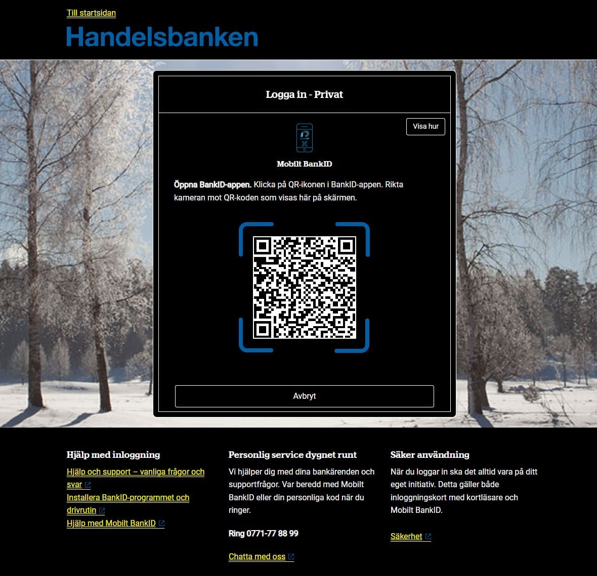

**Fråga användare efter**

# QR-kod

## Använd mönstret när

- Användaren ska logga in med BankID. Det är obligatoriskt med QR-kod för mobild BankID.

## Använd inte mönstret när (kan vi ta bort rubrik när det inte är relevant)

## Så fungerar mönstret

Hjälp alla användare att skanna en QR-kod genom att se till att:

- Att QR-koden inte döljs när sidan är förstorad till 400 procent 
- QR-koden följer med (”sticky”) om användaren förminskar eller ändrar storlek på webbläsarfönstret.
- QR-koden alltid syns i sin helhet, oberoende av webbläsarfönstret storlek. 
- QR-koden fungerar även i högkontrastläge med inverterade färger (mörkt läge).
  - Vit ram runt själva koden.
- Det finns tillräckligt med tid (minst 3 minuter) innan time-out
- Att instruktioner är tydliga och fungerar även för den som använder skärmläsare.
- Gör det möjligt att klicka för att förstora QR-koden (som en modal)
- Se till att förstorad QR-kod går att stänga med escape-tangenten, ESC (som modal)

## Exempel

Exempel på QR-kod i mörkt läge från Handelsbanken:

<picture>
  <source srcset="../assets/images/handelsbanken-qr-kod.webp" type="image/webp">
  
</picture>

## Bra exempel på stödtext

Här loggar du in med BankId på en annan enhet, till exempel din mobiltelefon eller läsplatta. Om ditt BankID finns på den enhet du använder nu, logga in med BankID på den här enheten.

### BankID med QR-kod

Så här gör du:

- Öppna appen för BankID.
- Tryck på QR-symbolen i appen för BankID.
- ikta kameran mot QR-koden.
- Följ instruktionerna i appen för att logga in.

Efter att du väljer att visa QR-koden har du 30 sekunder på dig att skanna den. Sedan avbryts inloggningen på grund av säkerhetsskäl. Du kan då prova igen.

### Forskning/användartestning av mönstret

- [Tillgänglig inloggning med QR-kod (axbom.se)](https://axbom.se/tillganglig-inloggning-med-qr-kod/)

### Utvecklarstöd på bankit.com

- [Skanna QR-kod (BankID)](https://support.bankid.com/sv/anvanda-mobilt-bankid/skanna-qr-kod)
